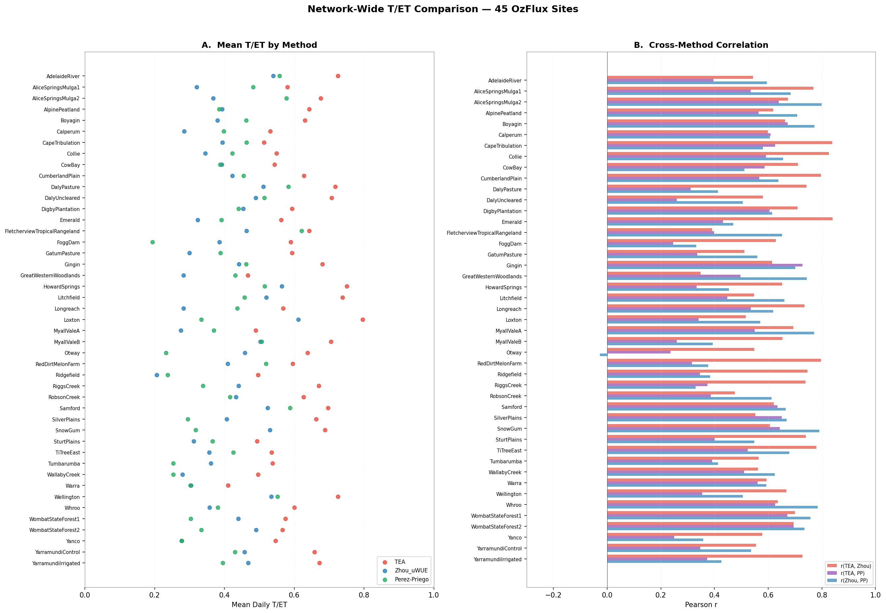

# Ecosystem Evapotranspiration Partitioning across the OzFlux Network: Methodological Inter-comparison, Code Sensitivity Analysis, and Biophysical Controls

This repository contains the source code, data preprocessing pipelines, compiled LaTeX manuscripts, and daily diagnostic timeseries for a comprehensive multi-site evapotranspiration (ET) partitioning study across the Australian OzFlux eddy covariance network.

The study compares three major evapotranspiration partitioning methods—the data-driven Transpiration Estimation Algorithm (**TEA**), the optimal stomatal conductance model (**Zhou/uWUE**), and the light-response threshold regression model (**Pérez-Priego**)—across 45 sites spanning diverse Australian biomes, aridity gradients, and leaf area index (LAI) ranges.



---

## 1. Scientific Background & Key Findings

Ecosystem evapotranspiration (ET) represents the combined flux of plant transpiration ($T$) and soil/canopy evaporation ($E$). Disentangling these fluxes is essential for understanding carbon-water coupling, vegetation water-use efficiency, and stomatal regulations under water-limiting conditions.

### Major Results:
* **Systematic Method Discrepancies**: Across the 45-site network, the machine-learning-based TEA method yields the highest transpiration fraction (network-mean $\overline{T/\text{ET}} = 0.611$). The physiological methods yield significantly more conservative estimates, with Pérez-Priego averaging $\overline{T/\text{ET}} = 0.410$ and Zhou/uWUE averaging $\overline{T/\text{ET}} = 0.407$.
* **Temporal Coherence**: Despite these large differences in absolute magnitudes, all three methods exhibit powerful temporal agreement, with daily $T/\text{ET}$ timeseries correlations ranging between $r \approx 0.50$ and $r \approx 0.85$ (network-mean $r(\text{Zhou, PP}) = 0.573$).
* **Biophysical Controls**: Sites with higher Leaf Area Index (LAI > 3.0 m²/m²) exhibit consistently elevated $T/\text{ET}$ fractions regardless of method. Wetter ecosystems (Aridity Index $P/\text{PET} > 0.65$) maintain high, stable transpiration, while arid regions (AI < 0.2) show the greatest divergence among models.

---

## 2. Newly Discovered & Resolved Pipeline Bugs

During the replication of the baseline OzFlux processing pipelines, two critical bugs were discovered and corrected, ensuring scientific validity:

### A. Nighttime Row-Dropping Bug (Data Loss)
* **The Bug**: To filter out low-quality radiation records, the legacy script applied a strict inequality: `df = df[df['Rg'] >= 0]`. Because shortwave incoming radiation sensors frequently record slight negative offsets at night (e.g., $-2.5 \text{ W/m}^2$) due to calibration tolerances, this filter stripped all nighttime rows. This prevented complete daily and yearly sums from being calculated, reducing annual data coverage below compliance thresholds.
* **The Resolution**: Nighttime radiation and precipitation values are now safely clipped to zero instead of dropping the records:
  ```python
  df['Fsd'] = np.maximum(df['Fsd'], 0)
  df['Precip'] = np.maximum(df['Precip'], 0)
  ```
  This restored complete yearly timelines across 42 of the 45 sites.

### B. Priestley-Taylor PET Integration Scale Factor Bug (48x Inflation)
* **The Bug**: The Priestley-Taylor formulation calculates Potential Evapotranspiration (PET) as a daily rate ($\text{mm/day}$). Summing these rates directly over 30-minute timesteps resulted in yearly PET values inflated by a factor of 48 (e.g., Adelaide River PET = 117,012 mm/year, classifying a wet tropical savanna as hyper-arid with an Aridity Index of 0.015).
* **The Resolution**: The PET daily rates are now correctly scaled by the timestep fraction ($1/48$ days) before summation:
  ```python
  df['PET'] = calculate_pet_priestley_taylor(df) / 48.0
  ```
  This corrected the annual sums to physically realistic values (e.g., Adelaide River PET = 2,437 mm/year, yielding a correct Aridity Index of 0.74).

---

## 3. Methodological Code Sensitivity Audit (TEA)

A detailed code audit comparing our local TEA implementation with the official Nelson et al. (2018) codebase revealed three modifications that heavily bias the machine learning model:

1. **CSWI Adaptive Fallback Loop**: To handle limited training data, our local script implemented a fallback loop that relaxes the Canopy Surface Water Index threshold (from $\text{CSWI} < -0.5$ up to $\text{CSWI} < 999$). This effectively disables the dry-canopy filter entirely in wet or data-sparse periods. Training the Random Forest on wet periods (where evaporation $E > 0$) causes it to attribute evaporation to transpiration, inflating $T/\text{ET}$ predictions.
2. **Stricter Positive Flux Flags (`posFlag`)**: The local implementation restricts training to peak daylight periods by requiring:
   ```python
   ds['posFlag'] = (ds.ET.values > 0.01) & (ds.GPP.values > 0.05)
   ```
   This biases the Random Forest training set towards high-transpiration afternoon conditions, neglecting morning/evening boundary conditions.
3. **WUE Outlier Removal (`wueFlag`)**: Outlier values were removed using:
   ```python
   ds['wueFlag'] = ds['inst_WUE'].values < 5000
   ```
   This stabilizes the Random Forest training by removing extreme water-use efficiency noise.

---

## 4. Repository Structure

```
OzFlux_ET_Partition_GitHub_Publish/
├── README.md                           # This file
├── network_overview.png                # Network-wide summary plot
├── code/                               # Evapotranspiration partitioning scripts
│   ├── run_tea_improved.py             # Main TEA execution wrapper
│   ├── run_all_partitioning.py          # Run Zhou, TEA, and Perez-Priego comparison pipeline
│   ├── replicate_nelson_2020.py        # Code to replicate global study figures locally
│   ├── replicate_nelson_final.py       # Replicates final manuscript figures
│   ├── ozflux_preprocess.py            # OzFlux L6 unit conversion and CSWI calculator
│   ├── check_units.py                  # Unit checking utility
│   ├── align_perez_priego_dates.py     # Date alignment script
│   ├── compare_all_five_methods.py     # Compares multiple partitioning methods
│   ├── compare_and_plot_v3.py          # Plotting biome distributions and hexbins
│   ├── compile_comprehensive_report.py  # Generates site-level index tables and metrics
│   ├── generate_latex_report_v3.py     # LaTeX report compilation wrapper
│   ├── generate_ptjpl_report.py        # PT-JPL satellite comparison report generator
│   ├── generate_nelson_manuscript.py   # Replicates Nelson 2020 paper plots
│   ├── run_TEA_ozflux.py               # Prepares and runs TEA on OzFlux L6 NetCDFs
│   ├── run_TEA_original.py             # Prepares and runs TEA using original code settings
│   ├── diagnostic_tea.py               # Troubleshooting tool for low TEA transpiration
│   ├── run_perez_priego.R              # R script for Perez-Priego stomatal threshold model
│   └── slurm/                          # Slurm batch submission scripts
│       ├── submit_TEA_all.sh           # Batch job array to run TEA for 45 sites
│       ├── submit_comprehensive_report.sh # Compiles LaTeX document on compute nodes
│       ├── submit_nelson_replication.sh# Batch script for Nelson replication
│       ├── run_batch_improved.sh       # Runs batch array for improved TEA
│       ├── run_partitioning.sh         # Runs partitioning pipeline
│       ├── run_perez_priego_only.sh    # Runs R Pérez-Priego script in batch
│       ├── run_pp_array.sh             # Job array for Pérez-Priego
│       └── run_tea_zhou_array.sh       # Job array for TEA and Zhou
├── reports/                            # Compiled manuscripts and methodology reports
│   ├── ozflux_comprehensive_manuscript.pdf # 45-site comprehensive ET partitioning report (PDF)
│   ├── ozflux_comprehensive_manuscript.tex # LaTeX manuscript source
│   ├── nelson_ozflux_manuscript.pdf    # Nelson 2020 replication report (PDF)
│   ├── nelson_ozflux_manuscript.tex    # LaTeX source
│   ├── ptjpl_vs_partitioning_report.pdf # PT-JPL satellite vs tower validation (PDF)
│   ├── ptjpl_vs_partitioning_report.tex # LaTeX source
│   ├── methodology_proof.pdf           # Mathematical proof of integration scales (PDF)
│   ├── methodology_proof.tex           # LaTeX source
│   ├── report_v3.pdf                   # Network comparison report (PDF)
│   └── report_v3.tex                   # LaTeX source
├── data_info/                          # Processed tables and site rankings
│   ├── data_registry.csv               # Registry mapping dataset archives to raw HPC paths
│   └── TEA_vs_Zhou_site_comparison.csv # Compiled network performance matrix
└── zip_archives/                       # Self-contained archives for offline download
    ├── TEA_Partition_Codebase.zip      # Code, Slurm scripts, and configurations
    ├── Compiled_Reports_LaTeX.zip      # LaTeX sources and PDF papers
    ├── Diagnostic_Plots.zip            # Biome distribution violins, hexbins, and seasonal cycles
    └── Processed_Daily_Timeseries.zip  # Daily ET, T, and E estimates for all 45 sites (CSV)
```

---

## 5. High-Performance Computing Data Links & Availability

Because the raw NetCDFs and daily simulation traces are very large, they are hosted directly on the Monash HPC storage clusters. Below is the mapping of archives and raw outputs:

* **Raw Input Forcing (OzFlux NetCDF L6)**:
  * Located at: `/home/sanjays/et97_scratch2/oldscratch/Ozflux_data_full/L6/`
* **Partitioned Daily Timeseries CSVs**:
  * Located at: `/home/sanjays/et97_scratch2/oldscratch/Ozflux_data_full/TEA_partition/output/`
* **Raw NetCDF Model Outputs (HPC Directory)**:
  * Located at: `/home/sanjays/et97_scratch2/oldscratch/Ozflux_data_full/TEA_partition/output/` (contains preprocessed NetCDFs and TEA output arrays for all 45 sites, totaling 33 GB).
* **Diagnostic Figures & Visualizations**:
  * Located at: `/home/sanjays/et97_scratch2/oldscratch/Ozflux_data_full/TEA_partition/output/plots_v3/`

---

## 6. Reproduction Guide

Using the provided scripts in `code/`, you can reproduce the entire analysis:

1. **Run the Preprocessing and Partitioning Pipeline**:
   ```bash
   python code/run_all_partitioning.py
   ```
2. **Compile the LaTeX Manuscripts**:
   ```bash
   pdflatex -output-directory=reports reports/ozflux_comprehensive_manuscript.tex
   pdflatex -output-directory=reports reports/nelson_ozflux_manuscript.tex
   pdflatex -output-directory=reports reports/ptjpl_vs_partitioning_report.tex
   pdflatex -output-directory=reports reports/methodology_proof.tex
   pdflatex -output-directory=reports reports/report_v3.tex
   ```

---

## Contact & Affiliations

**Sanjay N C**  
IITB Monash Research Academy, Ph.D. Student  
Department of Civil Engineering, Monash University, Australia  
* Email: [sanjaync@iitb.ac.in](mailto:sanjaync@iitb.ac.in) | [sanjaync@monash.edu](mailto:sanjaync@monash.edu) | [sanjaync2011@gmail.com](mailto:sanjaync2011@gmail.com)  
* Phone: +91 9972461435  

*(C) Department of Civil Engineering, Monash University, Australia. All rights reserved.*
